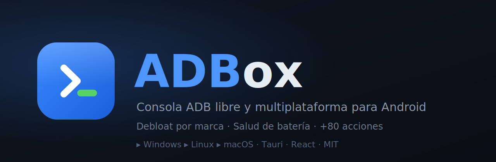

<p align="center">
  
</p>

<p align="center">
  <a href="LICENSE"></a>
  
  
</p>

**Consola ADB libre y multiplataforma para mantenimiento y reparación de Android.**

ADBox pone +80 acciones de `adb` organizadas en 15 categorías detrás de
una interfaz fluida en español: debloat por marca, salud real de batería,
diagnóstico de red por capas, backups, capturas, optimización en un clic y
mucho más. Sin línea de comandos, sin suscripciones y **100 % código abierto**.

> Alternativa libre a herramientas comerciales tipo "ADB toolkit". Construida
> con Tauri (Rust) + React, pesa ~10 MB y corre en Windows, Linux y macOS.

## ⬇️ Descargas

Binarios listos para cada sistema en la pestaña
**[Releases](../../releases)** (`.exe`/`.msi` para Windows, `.AppImage`/`.deb`
para Linux, `.dmg` para macOS). Se generan automáticamente con GitHub Actions
al publicar una versión.

---

## ✨ Qué hace

15 categorías sobre el dispositivo conectado por ADB:

| Categoría | Ejemplos |
|---|---|
| **Conexión** | Info del equipo, ADB por Wi-Fi, reinicios (normal/recovery/bootloader) |
| **Red e Internet** | Diagnóstico por capas, reparar "Wi-Fi sin internet", DNS seguro, datos |
| **Optimización** | Debloat por marca (Samsung, Xiaomi, Motorola, OPPO, Vivo, Huawei…), animaciones, AOT, Doze |
| **Batería** | Estado, temperatura y **salud real** (capacidad vs. fábrica + ciclos) |
| **Almacenamiento** | Uso, limpiar caché, liberar RAM, TRIM |
| **Apps** | Listar/instalar/desinstalar, forzar detención, respaldar APK |
| **Diagnóstico** | Crashes/ANR, **logcat en vivo**, bugreport |
| **Pantalla y captura** | Captura al PC, toques/teclas, encender/apagar |
| **Hardware** | Sensores, CPU, memoria, IMEI e identificadores |
| **Ajustes** | Leer/escribir settings (global/secure/system) |
| **Archivos y Respaldo** | push/pull, respaldo de fotos |
| **Rendimiento** | CPU, memoria y FPS |
| **Seguridad** | Permisos, verificación, administradores |
| **Reparación profunda** | Recompilar, reverificar, restablecer ajustes |
| **★ Mantenimiento completo** | Optimización automática en un clic |

### Sobre el debloat (importante)

El debloat usa `pm uninstall --user 0`, que **no requiere root** y es
**reversible**: las apps se restauran con «Restaurar apps de marca»
(`cmd package install-existing`) o con un restablecimiento de fábrica. Las
listas por marca viven en [`src/data/bloatware.ts`](src/data/bloatware.ts) y
son conservadoras a propósito — revisa cada paquete antes de ampliarlas.

---

## 💻 Requisitos

- **adb** (Android Platform-Tools) en el `PATH`. ADBox lo detecta solo;
  si no, puedes fijar la ruta manualmente.
- En el teléfono: **Depuración USB** activada y el PC autorizado.

## 🚀 Desarrollo

```bash
# 1) Dependencias de sistema (solo Linux) — Debian/Ubuntu:
sudo apt install -y libwebkit2gtk-4.1-dev build-essential curl wget file \
  libxdo-dev libssl-dev libayatana-appindicator3-dev librsvg2-dev pkg-config

# 2) Toolchain: Node 18+ y Rust estable (https://rustup.rs)

# 3) Instalar dependencias JS
npm install

# 4) Arrancar en modo desarrollo (abre la app de escritorio)
npm run tauri dev

# 5) Compilar binarios de distribución
npm run tauri build
```

En macOS y Windows no hace falta el paso 1; basta con Rust + Node.

---

## 🧱 Arquitectura

```
src-tauri/src/adb.rs   ← único punto de ejecución: envuelve el binario adb
                          (detección, devices, run, shell, logcat en streaming)
src/lib/adb.ts         ← puente TS → comandos Tauri
src/data/actions/*.ts  ← catálogo declarativo: 1 archivo por categoría
src/data/bloatware.ts  ← listas de debloat por fabricante
src/store.ts           ← estado global (zustand): consola, ejecución, diálogos
src/components/*.tsx    ← UI (Sidebar, Topbar, ActionGrid, Console, Dialog)
```

Cada acción es un objeto declarativo con un `run(ctx)` que recibe acceso
controlado a adb y a la consola. Añadir una acción nueva = añadir un objeto a
un archivo de categoría. No hay que tocar el backend salvo que necesites una
primitiva nueva.

---

## 🤝 Contribuir

Las contribuciones son bienvenidas: nuevas acciones, más marcas en el debloat,
traducciones. Abre un issue o un PR.

## 📄 Licencia

MIT — ver [LICENSE](LICENSE).
